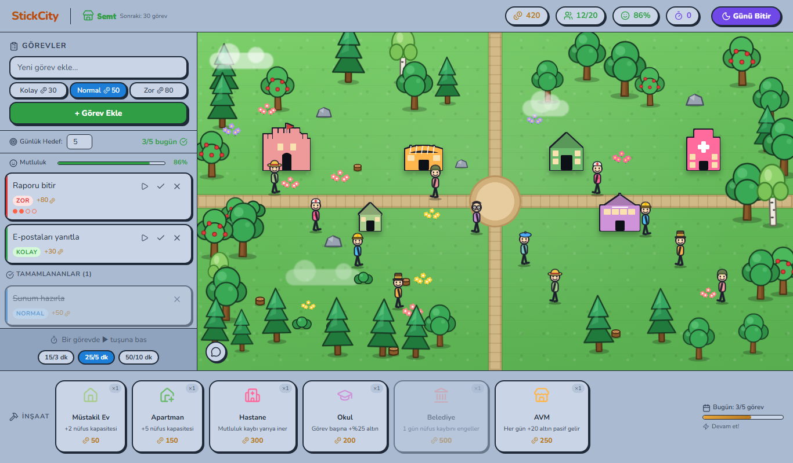
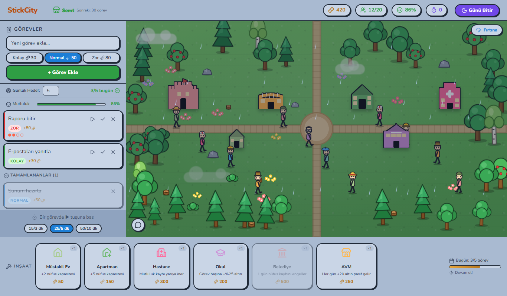

# StickCity Pomodoro

Görevlerini tamamla, pomodoro ile odaklan ve çöp adamlardan oluşan kendi şehrini büyüt.



## Nasıl çalışır?

- **Görev ekle** (kolay / normal / zor), pomodoro başlat ve tamamladıkça altın kazan.
- Her tamamlanan görev şehre yeni bir sakin getirir; sakinler mesleklerine göre giyinir ve şehirde dolaşır.
- Altınla **ev, apartman, hastane, okul, belediye ve AVM** inşa et, binalara tıklayarak yükselt.
- Çalışmadığında sakinler mutsuzlaşır ve hırsızlar çıkar; pomodoro başlatmak ya da hırsıza tıklamak onları kovar.
- Üst üste 3 pomodoro **Altın Çağ** (+%50 altın), günlük hedefi kaçırmak **fırtına** getirir.
- Şehir seviyesi: Mahalle → Semt → İlçe → Şehir → Metropol.



## Özellikler

- Pomodoro: duraklat, molayı atla, 15/3 · 25/5 · 50/10 süreleri, sesli uyarı, sekme başlığında geri sayım
- Günlük hedef ve gün sonu değerlendirmesi (uygulama kapalıyken geçen gün otomatik değerlendirilir)
- Şehre not bırak, sakinler söylesin
- Mobil uyumlu arayüz, ilerleme tarayıcıda saklanır

## Başlangıç

```bash
npm install
npm run dev
```

## Teknolojiler

React 18 · Vite · Lucide React · Vanilla CSS
